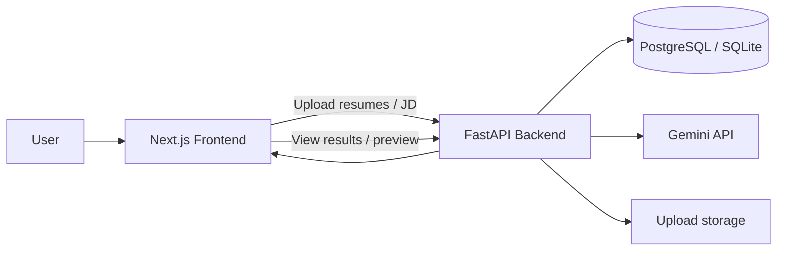

# Architecture

## Overview

Resume Screening & Candidate Ranking System is a two-part application:

- `frontend/` - a Next.js UI for uploading resumes and job descriptions, viewing results, and exporting rankings
- `backend/` - a FastAPI service that stores uploads, parses documents, scores candidates, and serves analysis results

The system is designed around a simple flow:

## Request Flow

### 1. Upload
- Users upload multiple resumes and one job description.
- The frontend sends files to the backend using multipart form data.
- The backend stores the files under the configured upload directory.
- Resume and job description metadata are persisted in the database.

### 2. Parsing
- Resumes are parsed through `app.services.resume_parser`.
- Job descriptions are parsed through `app.services.jd_parser`.
- Parsed text is stored on the record so later scoring does not depend on re-uploading.

### 3. Analysis
- The analysis endpoint loads resumes and the selected job description.
- The backend computes a deterministic local score for each candidate.
- If Gemini is configured and returns a valid response, it can contribute the skills match score.
- The final ranked results are stored in `analysis_results`.

### 4. Results and Preview
- The frontend reads the ranked analysis results.
- A candidate row can open a modal that loads the stored resume file from the backend.
- PDF previews are served inline so the browser can render them in an iframe.

### 5. Export
- The backend can export analysis results as CSV.
- The frontend also offers client-side CSV and Excel downloads from the loaded results.

## Backend Structure

### Core
- `app.core.config` - environment settings and logging configuration
- `app.core.database` - SQLAlchemy engine, session, and metadata setup

### Models
- `Resume` - uploaded resume metadata and extracted text
- `JobDescription` - uploaded job description metadata and parsed text
- `AnalysisResult` - candidate score, ranking, and score breakdown

### Services
- `resume_parser` - extracts text and structured resume details
- `jd_parser` - extracts structured job requirements
- `scoring_service` - deterministic scoring logic
- `gemini_service` - Gemini-backed comparison with fallback behavior
- `ranking_service` - orders candidates by final score
- `export_service` - formats analysis results for CSV export

### API Routes
- `resume_routes` - resume upload and preview endpoints
- `jd_routes` - job description upload endpoint
- `analysis_routes` - scoring, result lookup, and idempotency handling
- `export_routes` - CSV export endpoint

## Frontend Structure

### Screens
- Upload/screening workspace
- Ranked results dashboard
- Resume preview modal

### Data Flow
- `frontend/src/services/api.ts` is the central API client
- `useScreeningSubmission` handles analysis submission and request locking
- `useAnalysisResults` loads ranked candidate data for the results page

## Persistence Notes

- Uploaded files are stored on disk under the configured upload directory.
- Analysis results are stored in the database.
- The analysis layer now tracks `analysis_request_id` and enforces uniqueness by `resume_id + jd_id`.

## Operational Notes

- The backend creates upload directories on startup/use.
- Render deployments should provide a persistent database and a writable upload directory.
- For production, use a proper PostgreSQL database and configure `DATABASE_URL`, `GEMINI_API_KEY`, and `NEXT_PUBLIC_API_URL`.
